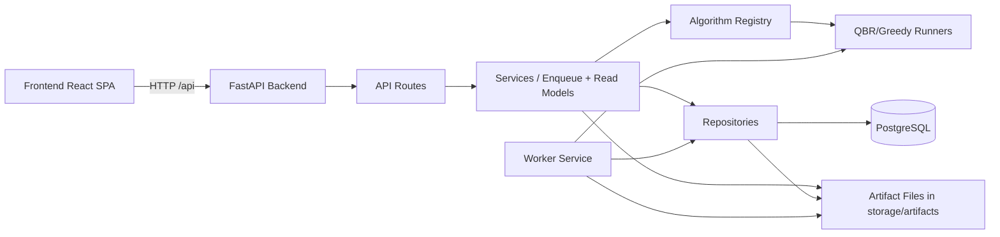
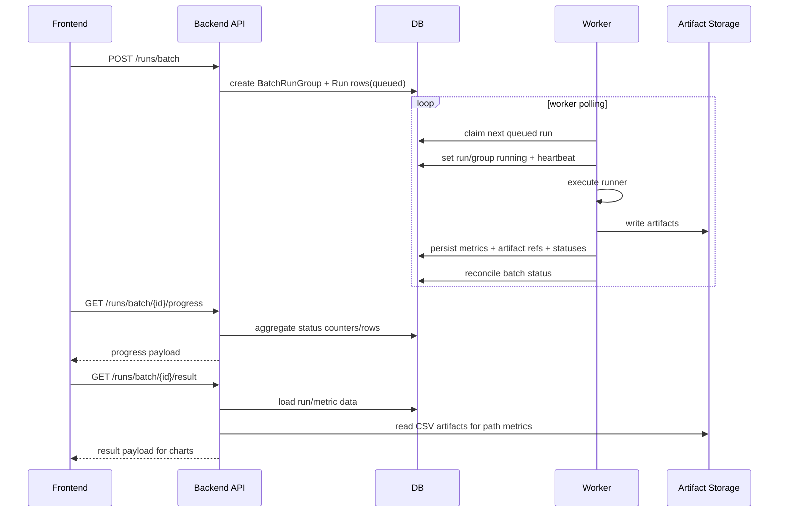

# SYSTEM_ARCHITECTURE

## 1) Overview

### Muc tieu he thong
- QBR la mot nen tang chay thi nghiem mang cam bien gom:
  - topology generation
  - single-run
  - batch-run
  - replay / result analysis
- He thong hien tai da co luong chay that cho generate, run single, run batch, stop/resume batch, xem ket qua/artifact.

### He thong nay dung de lam gi
- Tao topology (single/multi), quan ly batch topology.
- Chay thuat toan QBR/Greedy tren topology.
- Luu metadata run trong DB va artifact tren file system.
- Hien thi ket qua single-run va multi-run (charts, progress, replay).

### Pham vi hien tai (from code)
- Da implement phan lon chuc nang core.
- Compare A/B van la stub.
- Worker process doc lap da consume queue cho `single-run` va `batch-run`.
- Backend khong con chay batch bang in-process thread trong path chinh.

---

## 2) Top-level project structure

- `backend/` (core runtime):
  - FastAPI API, models, repositories, services, runners.
  - Day la noi thuc thi logic chinh va enqueue/read-model layer cua he thong.
- `frontend/` (core runtime):
  - React + Vite app, UI shell, state orchestration, charts/results.
- `storage/` (core runtime data):
  - `storage/artifacts/` run output files (DB is PostgreSQL).
  - `storage/artifacts/` artifact cua moi run.
- `worker/` (core runtime):
  - Worker process poll queue tren bang `runs`, claim job, heartbeat, execute runner, persist artifact/metric.
- `docs/` (support/spec):
  - Spec va TODO; mot so phan van can doc-sync.
- `configs/` (support):
  - Co default config, nhung khong phai single source of truth runtime cho toan bo luong.
- `docker-compose.yml` (support runtime orchestration):
  - Stack muc tieu: `postgres`, `backend`, `frontend`, `worker`.

---

## 3) Runtime architecture

### Cac thanh phan chay thuc te
- Frontend React SPA (`frontend/src/App.jsx` + components).
- Backend FastAPI (`backend/app/main.py`, `backend/app/api/routes.py`).
- Worker process (`worker/jobs/worker_main.py`).
- DB layer SQLAlchemy (`backend/app/core/db.py`).
- Artifact file persistence (`backend/app/services/run_engine_service.py` + `storage/artifacts`).

### Frontend / Backend / Worker / DB / Artifact storage
- Frontend goi API qua `VITE_API_BASE` (default `http://localhost:8000/api`).
- Backend route xu ly nghiep vu, enqueue `Run`, va doc DB/artifact de tra progress/result.
- Worker service claim `Run(status="queued")`, set `running`, heartbeat, execute runner, persist metric/artifact, reconcile batch status.
- DB:
  - Database: PostgreSQL (`DATABASE_URL` in `QBR/.env`; local dev via Docker Postgres).
  - Worker mode / Docker target chinh: Postgres.
- Artifact:
  - Moi run tao folder `storage/artifacts/<run_id>/...`.
  - DB table `artifacts` luu pointer `uri`, checksum, size.

### Thanh phan dang xu ly logic chinh
- `backend/app/services/run_engine_service.py` giu execution core cho 1 run.
- `worker/jobs/worker_main.py` la process claim va chay ca `single-run` va `batch-run`.
- Queue metadata nam tren bang `runs`; batch aggregate nam tren `batch_run_groups`.

---

## 4) Actual execution flows

## Flow generate topology
- Frontend submit generate form.
- Backend:
  - `POST /api/topologies/generate` -> `topology_service.generate_connected_topology()`.
  - `POST /api/topologies/generate/multi` -> `topology_service.generate_multi_topologies()`.
- Persist:
  - Topology + nodes vao DB (`topology_memory_repo.create_topology`).
  - Tinh va luu lower_bound (`topology_metrics_service.refresh_topology_lower_bound`).

## Flow edit/save topology
- Edit draft:
  - `PATCH /api/topologies/{id}/nodes` -> `topology_service.stage_topology_node_update`.
  - Clamp x/y, reject duplicate positions.
  - Draft luu tam in-memory `_TOPOLOGY_EDIT_DRAFTS`.
- Save:
  - `POST /api/topologies/{id}/save` -> `topology_service.commit_topology_updates`.
  - Persist node coordinates vao DB.
  - Mark run cu `warning_topology_changed=True`.
  - Recompute lower_bound.

## Flow single run
- Frontend run:
  - `POST /api/runs/single` (payload topo + algorithm + config + run_config).
- Backend:
  - `routes.run_single_topology` -> `run_engine_service.run_single_topology`.
  - Validate topology + payload.
  - Tao `Run(mode="single", status="queued", queue_priority=0)`.
  - Luu execution payload vao `Run.payload_json`.
- Worker:
  - Claim single run theo priority.
  - Set `running`, heartbeat, execute runner theo registry.
  - Persist metric + artifact refs + files.
- Contract hien tai:
  - Endpoint la async, response `RunSingleResponse(completed=False, run_id, message="Accepted.")`.
  - Frontend poll `GET /api/runs/{id}` va `GET /api/runs/history?...` de load ket qua khi run xong.

## Flow batch run
- Frontend run:
  - `POST /api/runs/batch`.
- Backend:
  - `run_engine_service.run_batch_topologies` tao `BatchRunGroup(status="queued")` + nhieu `Run(mode="batch", status="queued", queue_priority=100)`.
  - Khong spawn thread trong backend nua.
- Worker:
  - Poll queue tren bang `runs`.
  - Claim tung `Run(mode="batch")`.
  - Load batch payload tu `BatchRunGroup.payload_json`.
  - Execute tung topology run, persist artifact/metric, roi reconcile batch status.
- Stop/resume:
  - `POST /api/runs/batch/{id}/stop`
  - `POST /api/runs/batch/{id}/resume`
  - Stop semantics:
    - neu chua co run `running`, queued runs bi doi sang `stopped` ngay
    - neu dang co run `running`, worker finish run hien tai roi queued runs con lai moi bi doi sang `stopped`
  - Resume semantics:
    - `Run.status="stopped"` duoc doi lai thanh `queued`
    - worker claim lai theo queue ordering
- Delete batch run:
  - `DELETE /api/runs/batch/{id}` xoa rows va best-effort cleanup artifact files.

## Flow result/artifact loading
- Single run history:
  - `GET /api/runs/history?topology_id=...`
  - `GET /api/runs/{id}/artifacts/{artifact_type}` cho payload chart/replay.
- Batch results:
  - `GET /api/runs/batch/results` (list)
  - `GET /api/runs/batch/{id}/progress` (live progress)
  - `GET /api/runs/batch/{id}/result` (summary + density groups + topology points + path metrics)

## Flow run presets (DB-backed)
- Frontend:
  - Load presets qua `GET /api/presets` khi app bootstrap.
  - Create/update/delete preset qua `POST/PATCH/DELETE /api/presets`.
  - Da bo localStorage preset flow; app co cleanup legacy keys khi mount.
- Backend:
  - API routes trong `backend/app/api/routes.py`.
  - CRUD qua `backend/app/repositories/preset_repo.py`.
- Persist:
  - DB table `run_presets` (model `RunPreset` trong `backend/app/models.py`).

## Flow compare
- Route ton tai: `POST /api/compare/ab`.
- Hien tai la placeholder/stub, chua co compare logic that.

---

## 5) Algorithm integration

### Cac algorithm hien co
- Registry file: `backend/app/services/run_registry.py`.
- IDs dang dang ky:
  - `qbr` (hien thi **QBR**; softmax la `policy_type` trong config, khong phai algorithm rieng)
  - `greedy` (hien thi **GREEDY**; mac dinh UI/run form)
  - `cf_cas` (hien thi **CF-CAS**; collision-free critical-path aware scheduling, always-on T=1; runner `cf_cas_runner.py`, core `algorithms/cf_cas.py`)

### Config mechanism
- Backend:
  - `resolve_and_validate_run_config(...)` duoc goi truoc khi execute.
  - Registry tra metadata `default_config`, `config_schema`, `capabilities`.
- Frontend:
  - Dynamic config form render theo `config_schema`.
  - Shared state moi theo backbone (`qbr`, `greedy`, `cf_cas`) thay vi 1 object global duy nhat.

### QBR reward/training knobs hien tai
- `action_axis`: chon action tren candidate broadcaster hoac receiver.
- `completion_bonus_multiplier`: he so nhan completion bonus trong reward environment.
- Eligibility traces:
  - `lambda_param` va `trace_threshold` da duoc them vao QBR config.
  - `lambda_param > 0`: update Q theo TD-error + eligibility traces.
  - `lambda_param = 0`: giu path update Q-learning cu de dam bao backward-compatible behavior.

### Artifact output cua moi run
- QBR runners output nhieu artifact (run_summary, transmission/state_action per epoch, q_table, csvs...).
- Greedy baseline output subset nho hon.
- Batch co policy chon artifact theo `selected_artifact_types` va expansion rule (`path_signature` -> nhieu key artifact).

### Diem da generic vs hard-coded
- Generic:
  - Runner interface (`base.py`) + registry mapping.
  - Dynamic config schema to UI.
- Con hard-coded:
  - Artifact type names va expansion mapping trong `_expand_partial_artifact_types`.
  - Compare flow chua generic vi chua implement.

---

## 6) Data and persistence

### DB dang dung gi (local/dev/docker)
- Database: PostgreSQL only (`DATABASE_URL` required).
- Backend va worker dung chung `DATABASE_URL` va `storage/artifacts` (volume `QBR_ROOT` trong Docker).

### Luu artifact o dau
- Tren disk: `QBR/storage/artifacts/<run_id>/...`.
- DB table `artifacts` luu metadata va duong dan file (`uri`).

### Metadata vao DB vs payload ra file
- DB:
  - `runs`, `run_metrics`, `batch_run_groups`, `topologies`, `topology_nodes`, `topology_metrics`, `artifacts`, `batches`, `run_presets`.
  - `runs` dong vai tro queue item voi metadata:
    - `status`
    - `worker_id`
    - `heartbeat_at`
    - `claimed_at`
    - `attempt_count`
    - `queue_priority`
    - `payload_json`
- File payload:
  - JSON/CSV artifact noi dung lon/chi tiet.
- API read artifact:
  - Repo doc file theo `uri` de tra payload.

---

## 7) Source of truth and control points

- Backend app entrypoint: `backend/app/main.py` (`create_app`, exception policy, startup DB init).
- Backend routing: `backend/app/api/routes.py`.
- Backend execution core: `backend/app/services/run_engine_service.py`.
- Queue / progress / result aggregation: `backend/app/repositories/run_repo.py`.
- Algorithm registry + metadata/capability: `backend/app/services/run_registry.py`.
- Runner implementations: `backend/app/services/runners/*.py`.
- DB session/config: `backend/app/core/db.py`.
- Worker loop: `worker/jobs/worker_main.py`.
- Frontend UI shell + global orchestration: `frontend/src/App.jsx`.
- Main panel behavior by menu: `frontend/src/components/MainTopologyPanel.jsx`.
- Right-side control panel and config editor: `frontend/src/components/RightControlPanel.jsx`.
- Sidebar/menu + topology tree: `frontend/src/components/DashboardSidebar.jsx`.

---

## 8) Implemented vs Planned

| Feature/module | Current status | Evidence/source file |
|---|---|---|
| Topology generate single/multi | Implemented | `backend/app/api/routes.py`, `backend/app/services/topology_service.py` |
| Topology edit draft + save + lower_bound refresh | Implemented (draft in-memory) | `backend/app/services/topology_service.py`, `backend/app/services/topology_metrics_service.py` |
| Single run execution | Implemented (async via worker queue) | `backend/app/api/routes.py::run_single_topology`, `backend/app/services/run_engine_service.py`, `worker/jobs/worker_main.py` |
| Batch run enqueue/execute/progress | Implemented (async via worker queue) | `backend/app/services/run_engine_service.py`, `backend/app/repositories/run_repo.py`, `worker/jobs/worker_main.py` |
| Batch stop/resume | Implemented | `backend/app/api/routes.py`, `backend/app/repositories/run_repo.py`, `backend/app/services/run_engine_service.py` |
| Batch run deletion + artifact cleanup best-effort | Implemented | `backend/app/repositories/run_repo.py::delete_batch_run`, `backend/app/api/routes.py` |
| Run history/detail/artifact endpoints | Implemented | `backend/app/api/routes.py`, `backend/app/repositories/run_repo.py` |
| Results UI block single/multi, charts, progress table | Implemented | `frontend/src/components/MainTopologyPanel.jsx`, `frontend/src/App.jsx` |
| Dynamic config forms from schema | Implemented | `frontend/src/components/RightControlPanel.jsx`, `backend/app/services/run_registry.py` |
| Shared config model theo backbone | Implemented | `frontend/src/App.jsx`, `frontend/src/components/RightControlPanel.jsx` |
| Preset CRUD qua DB/API (`/presets`) | Implemented | `backend/app/api/routes.py`, `backend/app/repositories/preset_repo.py`, `backend/app/models.py`, `frontend/src/App.jsx`, `frontend/src/components/RightControlPanel.jsx` |
| QBR completion bonus multiplier + eligibility traces params | Implemented | `backend/app/services/run_registry.py`, `backend/app/services/runners/qbr_runner.py`, `backend/app/services/runners/template.py`, `backend/app/algorithms/br_env.py` |
| Compare A/B backend logic | Planned/Stub | `backend/app/api/routes.py::compare_ab` TODO |
| Compare UI real flow | Planned/Placeholder | `frontend/src/components/MainTopologyPanel.jsx` (`coming soon` branch) |
| External worker job processor | Implemented (manual local runtime verified) | `worker/jobs/worker_main.py`, `backend/app/repositories/run_repo.py`, `backend/app/services/run_engine_service.py` |
| Docker runtime verification | Partial | code path da cap nhat, nhung `docker compose` chua duoc verify runtime tren may test vi Docker daemon offline |
| Error response unification with richer machine-readable code | Partial | concise `Failed.` policy in `backend/app/main.py`; TODO in `docs/TODO_REQUIRED_LIST.md` |

---

## 9) Invariants / development rules

- Khong doi schema artifact names tuy tien neu chua co migration/compat layer.
- Khong them algorithm moi ma bo qua registry (`run_registry.py`) + metadata/schema/capability.
- Khong sua flow UI shell (menu/block) ma khong update docs/todo va verify state side effects.
- Worker architecture hien tai da chot boundary:
  - backend enqueue/doc status
  - worker claim/execute/heartbeat
  - khong dua thread execution tro lai vao backend path chinh ma khong co migration plan ro rang
- Batch lifecycle phai giu state machine nhat quan:
  - group level: `queued/running/stopped/completed`
  - run level: `queued/running/done/failed/stopped`
- Batch aggregate `completed` ngay ca khi co mot vai `Run.status = failed` la decision da chot theo UX hien tai.
- Moi thay doi endpoint contract phai doi chieu frontend caller va payload parser (`parseApiError`, artifact loaders).
- Khong bo qua cleanup artifact khi them delete flow moi.
- Khong thay doi run config semantics ma bo qua dynamic schema rendering path.
- Khi them tham so QBR moi (`completion_bonus_multiplier`, `lambda_param`, `trace_threshold`), phai cap nhat dong bo:
  - registry default/schema/validation
  - runner consume + artifact summary
  - frontend dynamic form/preset save-load compatibility

---

## 10) Known architectural mismatches

- `QBR/README.md` mo ta scaffold/stub nhung implementation hien tai da co nhieu flow runtime that.
- `worker/README.md` va doc lien quan can doc-sync tiep theo implementation worker queue hien tai.
- Compare duoc expose route/menu nhung backend va UI compare logic chua xong.
- Multi-worker: `npm run dev` (3 workers) hoac Docker `worker-1`..`worker-3`.
- Docker compose runtime chua duoc verify tren may test hien tai vi Docker daemon offline.

---

## 11) Recommended next steps

1. **Doc-sync pass**
   - Update README/worker/docs theo implementation worker queue hien tai.
   - Ghi ro Postgres la target chinh cho worker mode.
2. **Stale recovery + observability**
   - Bo sung `requeue_stale_runs(...)` loop trong `worker/jobs/worker_main.py`.
   - Bo sung log transition/claim/fail/recover.
3. **Hoan thien compare flow**
   - Implement backend compare logic that.
   - Thay placeholder UI bang compare view.
4. **Refine persistence safety**
   - Xem lai in-memory topology draft (can nhac DB-backed draft/session scope).
5. **Strengthen lifecycle tests**
   - queue claim priority
   - stop/resume/deletion/progress/state reconciliation
   - stale recovery
6. **Docker runtime verification**
   - Test `docker compose up` end-to-end khi Docker daemon san sang.
7. **Journal-grade reproducibility**
   - Bo sung run snapshot metadata (config hash, algorithm version, topology identity).

---

## 12) Appendix

### Architecture diagram (mermaid)

### Execution flow (frontend -> backend -> worker -> storage -> results)

### Files can doc dau tien (recommended reading order)

1. `backend/app/main.py`
2. `backend/app/api/routes.py`
3. `backend/app/services/run_engine_service.py`
4. `backend/app/repositories/run_repo.py`
5. `worker/jobs/worker_main.py`
6. `backend/app/services/run_registry.py`
7. `backend/app/services/runners/qbr_runner.py`, `greedy_runner.py`, va `cf_cas_runner.py`
8. `backend/app/models.py`
9. `frontend/src/App.jsx`
10. `frontend/src/components/MainTopologyPanel.jsx`
11. `frontend/src/components/RightControlPanel.jsx`
12. `frontend/src/components/DashboardSidebar.jsx`
13. `docs/ui_backend_spec_v1.md`
14. `docs/TODO_REQUIRED_LIST.md`
