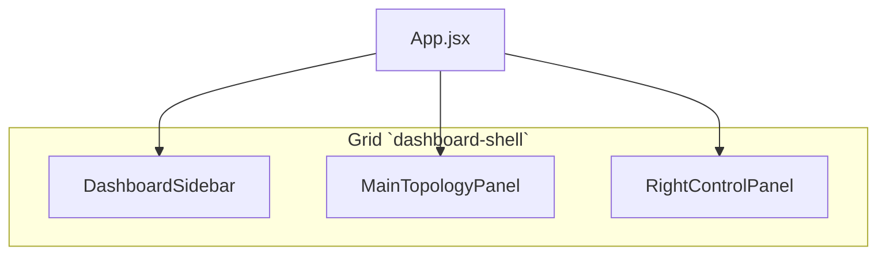

# Frontend shell — layout & navigation (QBR)

Tài liệu này ghi **cấu trúc cố định** của UI để khi sửa code (đặc biệt `App.jsx`) không vô tình ẩn menu, tắt cột phải, hoặc lệch hành vi màn hình.

## Cây component (tổng quan)

- **Nguồn state điều hướng chính**: `activeMenu` trong `App.jsx` (string).
- **Tab cột phải (khi có)**: `activePanel2Tab` — `"detail"` | `"edit_topo"` | … tùy màn.

## Giá trị `activeMenu` (đừng đổi tên tùy tiện)

| Giá trị        | Ý nghĩa              | Ghi chú layout |
|----------------|----------------------|----------------|
| `home`         | Trang tổng quan      | 3 cột (có `RightControlPanel`) |
| `topologies`   | Batch / topo         | 3 cột; panel phải phụ thuộc `focusedBatchId` / `focusedTopologyId` |
| `generate`     | Sinh topology        | **2 cột** — `activeMenu === "generate"` → class `generate-only-layout`, **ẩn** `RightControlPanel` |
| `run_topo`     | Chạy một topo        | 3 cột |
| `run_multi`    | Chạy nhiều topo (sub-mode: Multi topologies / Repeat 1 topology) | 3 cột |
| `compare`      | So sánh A/B          | **2 cột** (ẩn `RightControlPanel`, class `generate-only-layout`); `CompareWorkspace` — toggle **Batch results** / **Single topology results**, hai cột **A** và **B** chọn kết quả độc lập |

Nếu thêm màn mới: cập nhật bảng này + nút trong `DashboardSidebar.jsx` + nhánh render trong `MainTopologyPanel.jsx` / `RightControlPanel.jsx` nếu cần.

## Quy tắc hiển thị cột phải (Topologies)

Chỉ áp dụng khi `activeMenu === "topologies"` — logic chi tiết nằm trong `RightControlPanel.jsx`:

1. **Lưới batch** (`!focusedBatchId && !focusedTopologyId`): Detail / Edit = vùng trống (không gắn topo cũ).
2. **Chỉ chọn batch**: Detail = thông tin batch; Edit = gợi ý chọn topology.
3. **Đã chọn topology**: Detail = API detail; Edit = bảng node.

## Cách duy trì tài liệu này

1. **Commit cùng PR** khi đổi shell (menu, grid, panel).
2. **Git**: `git log -- QBR/docs/frontend_app_shell.md` để xem lịch sử ý định UI.
3. **Cursor rule**: `.cursor/rules/qbr-frontend-shell.mdc` — áp dụng khi mở/sửa `QBR/frontend/src/App.jsx` (nhắc đọc file này trước khi ẩn menu hoặc đổi layout).

## File liên quan (chỉnh layout là chỉnh đây)

| File | Vai trò |
|------|---------|
| `frontend/src/App.jsx` | Shell, `activeMenu`, điều kiện render `RightControlPanel` |
| `frontend/src/components/DashboardSidebar.jsx` | Menu trái + Topology Tree |
| `frontend/src/components/MainTopologyPanel.jsx` | Nội dung giữa theo từng màn |
| `frontend/src/components/CompareWorkspace.jsx` | Màn Compare: hai panel A/B |
| `frontend/src/components/BatchResultDetailBody.jsx` | Charts batch result (Results + Compare) |
| `frontend/src/components/RightControlPanel.jsx` | Tab Detail / Edit / Run config |
| `frontend/src/styles.css` | `dashboard-shell`, `generate-only-layout` |
